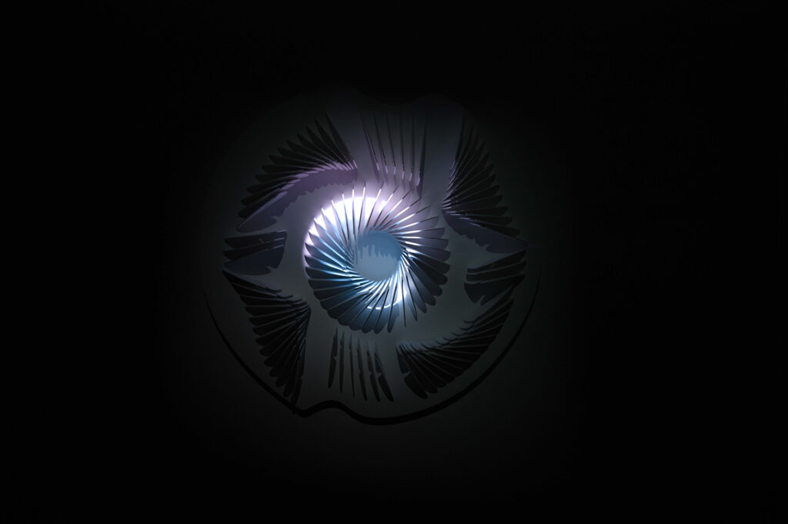
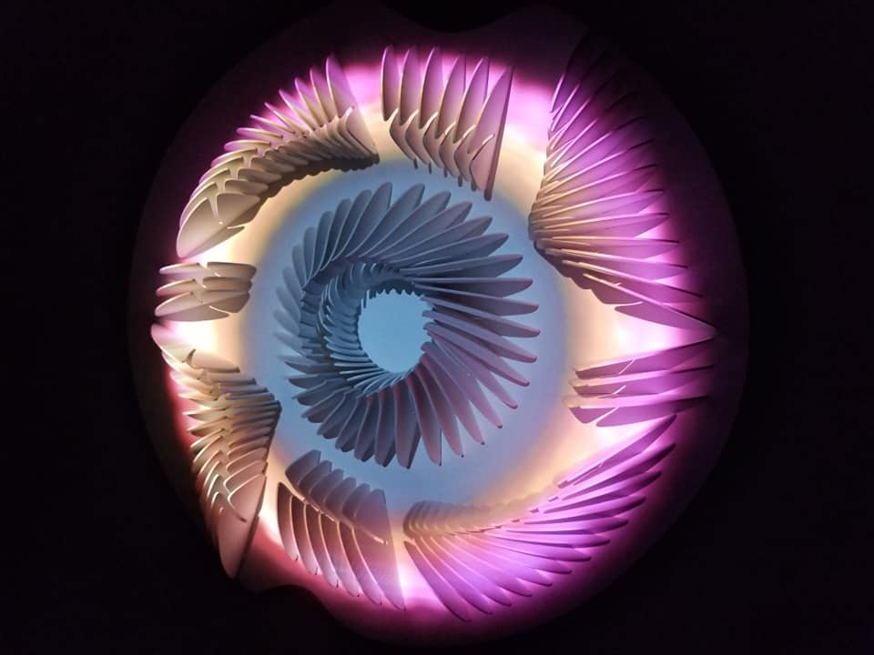
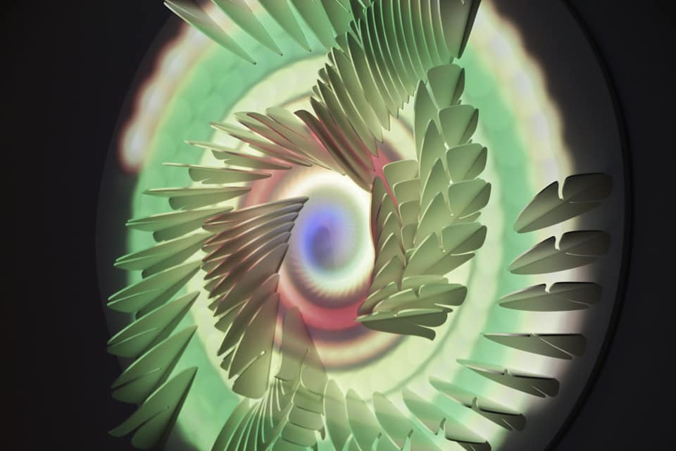
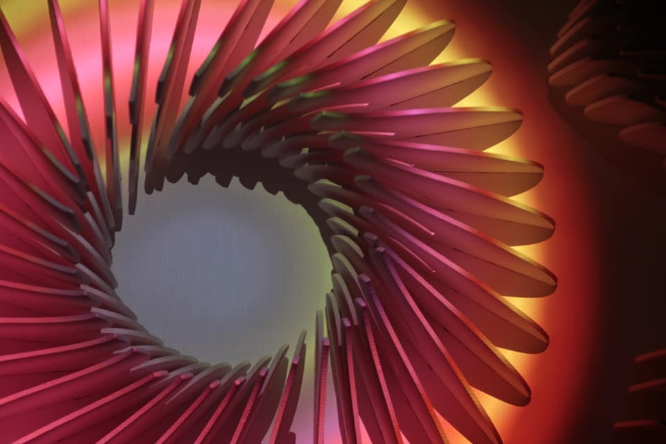
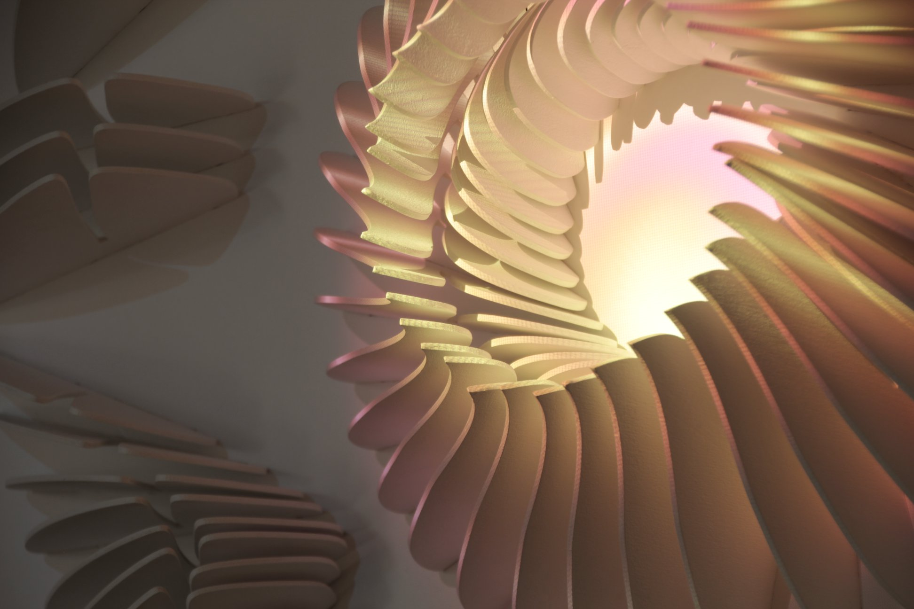
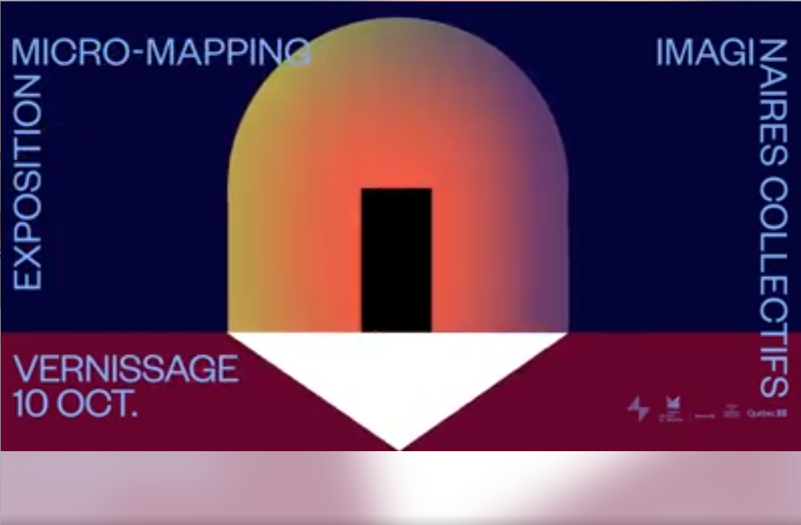
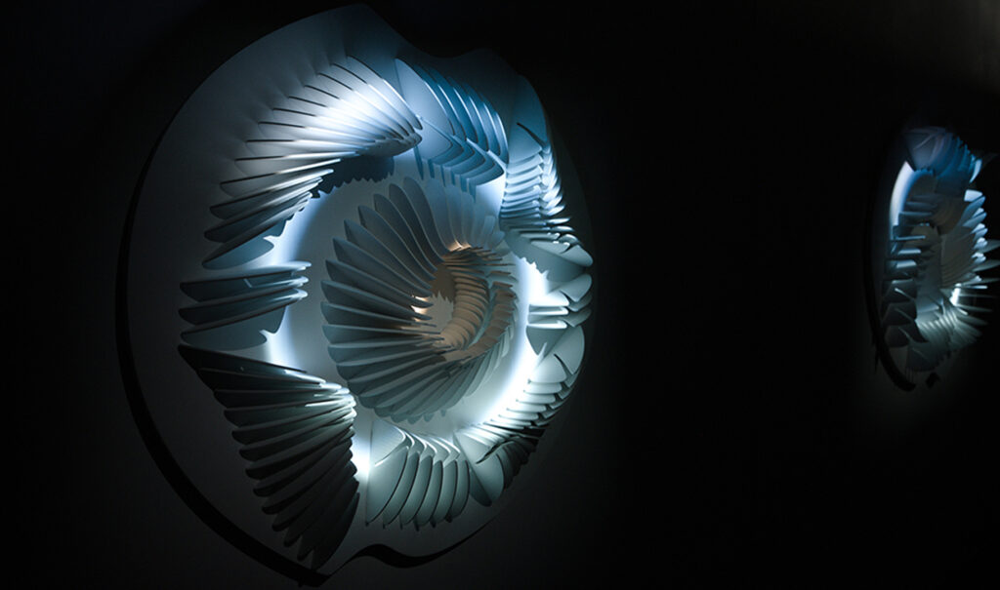
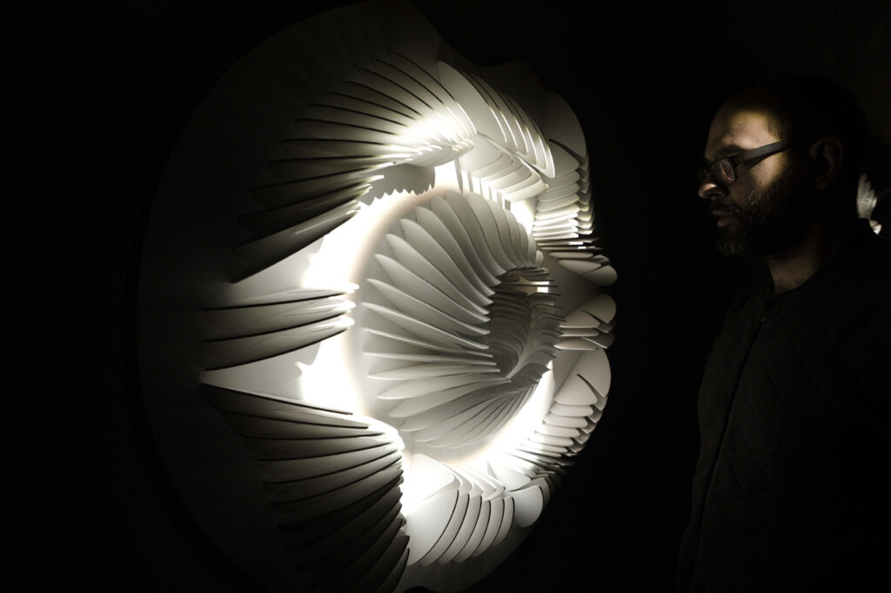
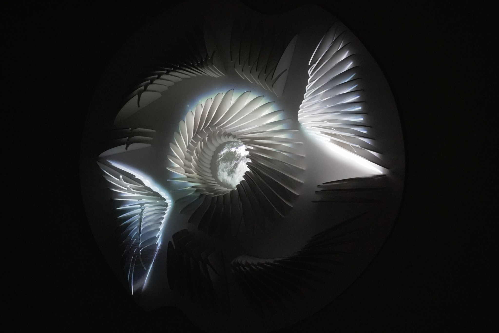
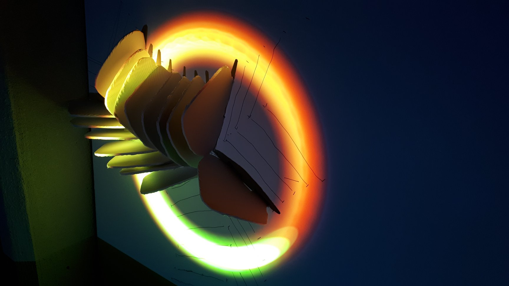

# Documentation de l'oeuvre numérique - Isochrone

source photo : Rendez-vous Québec Cinéma,Cinémathèque Québécoise, Montréal (CA), 2020

## Équipe
Isochrone est une création numérique créer par Manuel Chantre du Studio Chantre en collaboration avec Francis 
Tremblay ainsi que le Cégep André-Laurendreandeau et supporter financièrement par le gouvernement du Québec.

#### Concept, dessin technique paramétrique, production, ateliers 
 Manuel Chantre
 
#### Contribution visuel 
 Francis Tremblay

#### Équipe étudiante (sculpture)
 Sarra Boussoukaya
  
 Madouba Diallo 
  
 Maité Muriel Ingar Diaz 
  
 Diego Jacazio
  
 Nathalie Nguyen 
  
 Chloé Puigpinos 
  
 Francis Tremblay
 
#### Reconnaissance 
 Bruno Santerre et Gilbert Forest du cégep André-Laurendreandeau
  
 Olivier Toutiras Anaïs Beauchemin de la Maison de la Culture Marie-Uguay
  
 Olivier Heaps-Drolet
  
 Annie Lévesque 
  
 Patrick Akadji 
  
 Émilie Lévesque-Clément
 
## Date et endroit
 #### Maison de la cutlture Marie-Uguay (CA) 2019.
C' est un lieu qui offre des spectacle et expositions gratuites à moins de indication contraire et toute l'année elle offre des évènement 
qui permmettent de découvrir des ouevres avec d' uniques forme d'art ainsi que d'autre discipline d'art. 
  
 
 

sources photos: https://www.facebook.com/creationsculpturevideo/?locale=mk_MK
 #### MAPP_MTL, Never Apart, Montreal (CA), 2019-2020 (sculpture I)
MAPP MTL transforme des espaces publics en liberté d'expression artistique en s' appuyant à la projection mapping. Son objectif principal est de favoriser 
le développemnt de la projection mapping en partageant cet avancement avec le quartiers afin de devenir le lien entre les artistes, habitants et le
quartier.
À l'année de l' exhibition, c'était autour du temps de covid-19 donc MAPP MTL et Never Apart se sont unit pour organiser une ehebition virtuel
où les visiteur pouvait visiter les art nuériques 3d virtuellement avec du micro-mapping.
  

sources photos: https://www.facebook.com/creationsculpturevideo/?locale=mk_MK  

 #### Rendez-vous Québec Cinéma,Cinémathèque Québécoise, Montreal (CA), 2020
Un festival dédié au cinéma uniquement couvrant plusieurs genres et d' approche cinématographique. Cette compagnie n' est pas entièrement 
focussé sur le cinéma, elle offre à ses visiteurs également des évènement gratuite relié à d'autre genre d'art afin d'encourager les 
artiste dans leur démarche artistique.
À l'espace rendez-vous(collaboration avec hydro québec et radio canada) du 27 février au 7 mars, Rendez-vous Québec Cinéma permet les 
visiteur du festival à découvrir des arts numériques québecoises gratuitement qui inclu Manuel Chantre.
  
 
 
  
source photo : Rendez-vous Québec Cinéma,Cinémathèque Québécoise, Montréal (CA), 2020   

 #### Mutek, Village Numérique, Montreal (CA), 2024
 C'est un parcours urbain où la technologie et la créativité s' unissent. À la tombée de la nuit, le Quartier des scpectacles se
 transforment en galerie d' art ouverte au publique. Les visiteurs peuvent admirer et intéragir avec les arts numériques et découvrir de 
 nouveau monde grâce ces expériences.
   

sources photo: https://www.facebook.com/creationsculpturevideo/?locale=mk_MK

## Description de l' oeuvre
Isochrone est une série de sculpture avec la projection de lumières-vidéos faites avec divers ateliers d'initiation aux arts numériques, le vidéo 
mapping, la découpe de laser sur le bois et du design paramétrique. Ainsi la sculpture et le mouvement circulaire sont générer par des formules 
mathématiques du cercles et du spirale. Sa forme tridimensionnelle en bois et son mouvement lumineux représentent la notion d’isochronisme, 
c’est-à-dire la simultanéité de deux phénomènes.Ce projet a permit aux étudiants du Cégep André-Laurendreau de l' hivers 2019 de participer 
activement afin de réaliser cette oeuvre en fusionnant leur connaissance mathématique avec leur créativité.

Cette oeuvre  fusionne les sciences et l'art ensemble, où le mouvement circulaire et son cycle unissent ces deux notion ensemble. 
L' intention derrière cette oeuvre est d'illustrer le processus naturel de la croissance des plantes en se basant sur la suite Fibonacci, qui
est une série de nombre exprimant la croissance des végétaux en forme spirale comme les pépins de pommes et de pelure d'annanas , ainsi que de 
design paramétrique et  de représentation artistiques des plantes . 
Manuel Chantre cherche à démontrer la beauté des structures naturelles (plantes) et de leur intégration dans le domaine de l'art.

Cette oeuvre cible le publique général enfant autant que les adultes -
la sculpture qui fait portrait de la science et l'art avec l'intention de démontrer le proccessus
de croissance des plantes et sa beauté nous plonge dans une immersion de couleurs lumineuse  qui plait autant aux enfants 
qu' aux adultes.

### Aspects Techniques
Bois, peinture acrylique, lecteur de fichier vidéo, projecteur vidéo .

   

sources photo: https://www.facebook.com/creationsculpturevideo/?locale=mk_MK

## Fonctionnement et composante de l'oeuvre
Le motion circulaire lumineux soutenue par la sculpture démontre la représentation artistique de Emmanuel Chantre sur
la croissance des plantes.

Cette représentation est démontrer par des motions circulaires lumineuses  générés avec des formules mathématiques qui immerse le visiteur 
dans la croissance de plantes de façon artistique.

Cette composante au centre de l'oeuvre crée une harmonie entre l'art numérique et traditionnel qui est aussi mélanger avec la sciences
démontre de l'avance dans le domaine des arts, démontrant du mélange de la technologie avec l'art.

